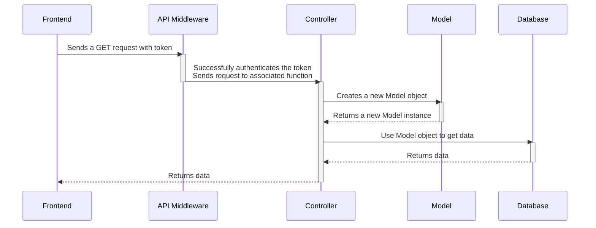
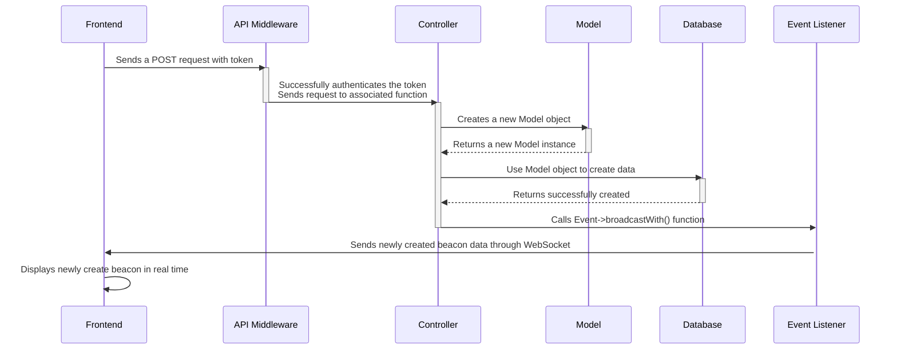

# Backend Overview
This guide is meant to provide a general understand of how the Laravel backend works and start coding as quickly as possible.

This guide will use the `sail` command. For docker commands, check out the [Docker commands guide](/contributing/docker-commands).

**The purpose of backend is move data between the frontend and database.** It does that by creating a url route in the `routes/api.php` file. Each route is mapped to a function inside the Controller files to handle that data. Each Controller file explicitly uses its associated Model file to send data to the database. For each Model file, Laravel will use their associated migration files to send data to the database behind the scenes.
- Uses Laravel as the API backend ONLY
- Uses Laravel WebSockets to push real-time changes
- Uses the Laravel Sanctum middleware to create private API routes

## Data flow

### HTTP requests

### WebSockets

## Backend concepts
- Laravel is an MVC framework, so it follows and uses the MVC pattern
- MVC pattern
  - The Model refers to the database. These files can read and write to the database.
  - The View refers to the frontend.
  - The Controller is the middleman that moves data between the model/database and the view/controller. It handles and processes HTTP requests. For example, it receives data from the frontend, processes it, then sends it to the database.
- HTTP requests:
    - GET - gets data
    - POST - creates data
    - PATCH - updates some data
    - PUT - updates data
    - DELETE - deletes data
- API routes:
  - Routes are basically subpage urls. For example, `/images` is a subpage route for `google.com/images`.
  - API routes are links that are specifically used for sending data to and from the server and requires authentication to access the link/route.
  - API routes must be routed through middleware to make them private, called "authenticating routes/API's"

## Laravel files and folders

We don't actually need to manually create any files in Laravel. We can use the `sail artisan` commands to scaffold files for us in. Check out the **Laravel Commands** section on how to generate files.

**For API's:**
- `routes/api.php`: creates routes to receive data from the backend and maps each route to a Controller method
- `app/Http/Controllers/`: defines methods on how to process the data and sends it to the database.

**For databases:**
- `app/Models/`: lists table fields and they should be accessed
  - Naming convention: the singular form of the table
  - the model class will know which database table to use based on the model name. For the `Book` class, the table `books` will be used.
- `database/migrations/`: converts the php datatype into the MongoDB datatype
- `config/database.php`: configures Laravel to use MongoDB
- `.env`: configures Laravel to use MongoDB

**For WebSockets:**
- `app/Event/`: triggers websocket event
- `app/Listener/`: sends data through websocket when event is triggered
- `app/Providers/EventServiceProvider.php`: a file to register events and event listeners so that Laravel can use them and recognize them

**For testing:**
- `app/tests/Feature`: all the feature test files