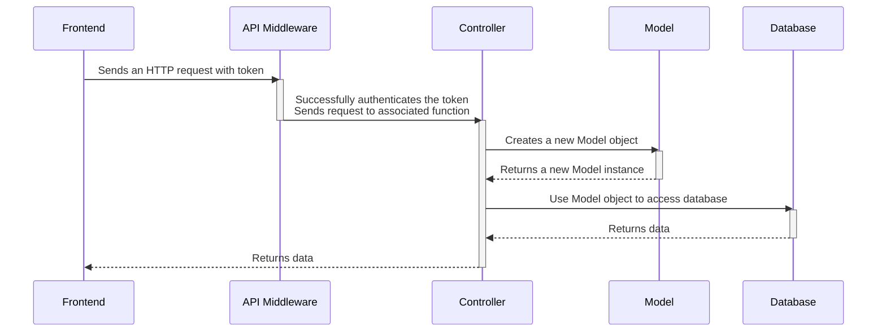
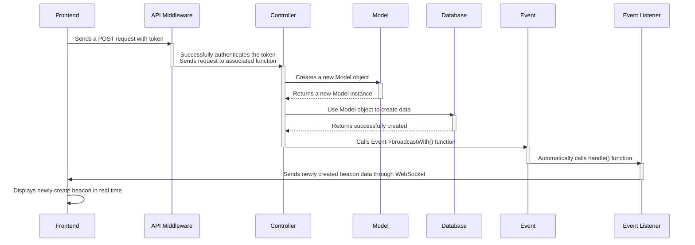

# API Docs

Laravel is used as the API backend and acts as the middleman to move data between the frontend and the database.

## Data Flow

The backend will most likely use a combination of HTTP requests and WebSockets to move data between the frontend and the database.

### HTTP requests

Most of the data sent between frontend and database will be through HTTP requests. The sequence diagram below shows an example of how a an HTTP request sent from the frontend would be handled in the backend and then pushed to the database and eventually returned to the frontend.

The API backend for HTTP requests uses 3 classes to move data: API Middleware, Controller, and Model.
- The API middleware creates the API routes and authenticates them through the Laravel Sanctum middleware.
- The Controller uses an instance of the Model class to read and write to the database.
- The Model class defines an object class for each database collection.



### WebSockets

When a new beacon or a new comment is created, that data will be added into the database from HTTP requests and then RETURN to the frontend THROUGH the WebSocket.

Or it can just create a beacon through the WebSocket and then broadcast that change to all users through the WebSocket.



## JSON Overview

A list of all acceptable fields for the Users data, Beacons data, and the Reports data.

### Users JSON data

Contains data about the user's account settings, profile settings, and friends.

```js
"Users": { // JSON data for Users
  "user_id": int, // Unique identifier
  "email": "", // Registration
  "username": "", // Public identifier
  "password": "", // 3 guesses
  "first_name": "", // Registration (do we need this?)
  "last_name": "", // Registration (do we need this?)
  "profile": { // public information, filters, accountability
    "about me": "",
    "profile_pic": ""
    "beacons_hosted": [{Beacons.beacon_id, Beacons.title, Beacons.image}],
    "beacons_attended": [{Beacons.beacon_id, Beacons.title, Beacons.image}],
    "preferred_games":"",
    "preference_tags":"",
  },
  "friends": [{Users.user_id, Users.profile.profile_pic, Users.username}, {}]
}
```

### Beacon JSON data

Contains data about beacon information, map coordinates, a list of comments made about the beacon, and a list of players attending the beacon.

```js
"Beacons": {
  "beacon_id": int, // Unique identifier
  "host_id": "", // user_id of the User
  "title": "", // What is going to happen at the event (doubles practice, mario wonder, pokemans vgc, etc.)
  "game": {
    "game_title": "",
    "game_image": ""
  },
  "date": "",
  "time": "",
  "location":  {
    "description": "", // Address / Name of place
    "latitude": float, // For the map
    "longitude": float // For the map
   },
  "players_needed": int, // Amount of players wanted
  "players_attending": [{user_id}], // List of players attended
  "comments": { // A place of intelligent discussion and detailed politics
    "comment_id": int, // Unique identifier
    "beacon_id": int, // What beacon its connected to
    "user_id" :int, // user_id of the commenter
    "body": "", // The comment
    "timestamp: "" // Timestamp
  }
}
```

### Reports JSON data

Contains data about the user making the report, the user being reported, the reason for the report, and a timestamp.

```js
"Reports": {
  "report_id": int, // Unique Identifier
  "reportee_id": "", // the user making the report
  "reported_id": "", // the user being reported
  "body": "", // reason why they're being reported
  "timestamp: "" // timestamp
}
```

## REST API's

All routes will be authenticated through the Laravel Sanctum middleware.

<!-- TODO: Add link to Laravel's API docs -->
[Link to API docs]