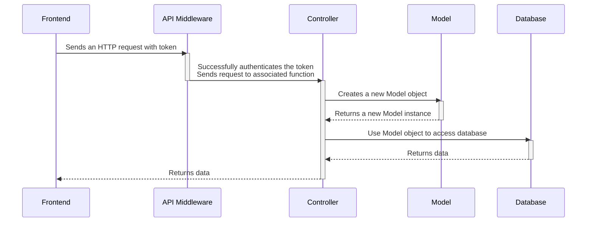
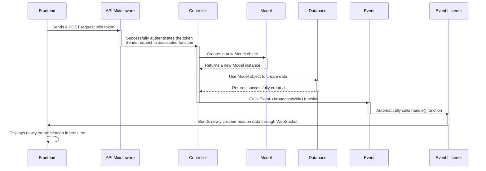

# API Design

This will likely be changed as we hammer out the details / decide how we want to do this.

Laravel is used as the API backend and acts as the middleman to move data between the frontend and the database.

## Data Flow

The backend will most likely use a combination of HTTP requests and WebSockets to move data between the frontend and the database.

### HTTP requests

Most of the data sent between frontend and database will be through HTTP requests. The sequence diagram below shows an example of how a an HTTP request sent from the frontend would be handled in the backend and then pushed to the database and eventually returned to the frontend.

The API backend for HTTP requests uses 3 classes to move data: API Middleware, Controller, and Model.
- The API middleware creates the API routes and authenticates them through the Laravel Sanctum middleware.
- The Controller uses an instance of the Model class to read and write to the database.
- The Model class defines an object class for each database collection.



### WebSockets

When a new beacon or a new comment is created, that data will be added into the database from HTTP requests and then RETURN to the frontend THROUGH the WebSocket.

Or it can just create a beacon through the WebSocket and then broadcast that change to all users through the WebSocket.



## JSON Overview

A list of all fields for the Users data, Beacons data, and the Reports data that will be sent as JSON between frontend, backend, and databse.

### Users JSON data

Contains data about the user's account settings, profile settings, and friends.

```js
"Users": { // JSON data for Users
  "user_id": int, // Unique identifier
  "email": "", // Registration
  "username": "", // Public identifier
  "password": "", // 3 guesses
  "first_name": "", // Registration (do we need this?)
  "last_name": "", // Registration (do we need this?)
  "profile": { // public information, filters, accountability
    "about me": "",
    "profile_pic": ""
    "beacons_hosted": [{Beacons.beacon_id, Beacons.title, Beacons.image}],
    "beacons_attended": [{Beacons.beacon_id, Beacons.title, Beacons.image}],
    "preferred_games":"",
    "preference_tags":"",
  },
  "friends": [{Users.user_id, Users.profile.profile_pic, Users.username}, {}]
}
```

### Beacon JSON data

Contains data about beacon information, map coordinates, a list of comments made about the beacon, and a list of players attending the beacon.

```js
"Beacons": {
  "beacon_id": int, // Unique identifier
  "host_id": "", // user_id of the User
  "title": "", // What is going to happen at the event (doubles practice, mario wonder, pokemans vgc, etc.)
  "game": {
    "game_title": "",
    "game_image": ""
  },
  "date": "",
  "time": "",
  "location":  {
    "description": "", // Address / Name of place
    "latitude": float, // For the map
    "longitude": float // For the map
   },
  "players_needed": int, // Amount of players wanted
  "players_attending": [{user_id}], // List of players attended
  "comments": { // A place of intelligent discussion and detailed politics
    "comment_id": int, // Unique identifier
    "beacon_id": int, // What beacon its connected to
    "user_id" :int, // user_id of the commenter
    "body": "", // The comment
    "timestamp: "" // Timestamp
  }
}
```

### Reports JSON data

Contains data about the user making the report, the user being reported, the reason for the report, and a timestamp.

```js
"Reports": {
  "report_id": int, // Unique Identifier
  "reportee_id": "", // the user making the report
  "reported_id": "", // the user being reported
  "body": "", // reason why they're being reported
  "timestamp: "" // timestamp
}
```

## API Routes

All routes will be authenticated through the Laravel Sanctum middleware. The authentication will be setup under the "User" resource. This way, each user will have their own authentication token to access the API backend.

API routes will be generated by the `Route::apiResources()` function (in the `routes/api.php` file) for the "users" collection and the "beacons" collection. It automatically generates the basic CRUD routes and maps them to one of the CRUD methods: `index`, `store`, `show`, `update`, and `destroy`.

```php
// in the 'routes/api.php' file
use App\Http\Controllers\UserController;
use App\Http\Controllers\BeaconController;

// not sure if this is actually how laravel sanctum is supposed to be used
Route::middleware('auth:sanctum')->apiResources([
  "users" => UserController::class,
  "beacons" => BeaconController::class
]);
```

Additional routes for the beacon will be generated to get a list of beacons by location and to get a list of beacons by recommendation:

```php
// in the 'routes/api.php' file
use App\Http\Controllers\BeaconController;

// not sure if this is actually how laravel sanctum is supposed to be used
Route::middleware('auth:sanctum')->get('/beacons/{location}', [BeaconController::class, 'showNearby']);
Route::middleware('auth:sanctum')->('/beacons/recommended', [BeaconController::class, 'showRecommended']);
```

And the "reports" collection will only have one API route to create a report:

```php
// in the 'routes/api.php' file
use App\Http\Controllers\ReportController;

// not sure if this is actually how laravel sanctum is supposed to be used
Route::middleware('auth:sanctum')->post('/reports', [ReportsController::class, 'store']);
```

## Controller Classes
### UserController Class

The purpose of this class is to handle data pertaining to the `/api/users` route for the following HTTP requests:
- GET /api/users/: handled by the `index` method, gets a list of users
- GET /api/users/{id}: handled by the `show` method, gets a specific user from user_id
- POST /api/users/: handled by the `store` method, creates a new user
- POST or PATCH /api/users/: handled by the `update` method, updates all user information or partial user information
- DELETE /api/users/{id}: handled by the `destory` method, deletes the specified user using the user_id

### BeaconController Class
The purpose of this class is to handle data pertaining to the `/api/beacons` route for the following HTTP requests:
- GET /api/beacons/: handled by the `index` method, gets a list of beacons
- GET /api/beacons/{id}: handled by the `show` method, gets a specific beacon from beacon_id
- GET /api/beacons/{location}: handled by the `showNearby` method, gets a list of beacons nearby
- GET /api/beacons/recommended: handled by the `showRecommended` method, gets a list of beacons recommended
- POST /api/beacons/: handled by the `store` method, creates a new beacon
- POST or PATCH /api/beacons/: handled by the `update` method, updates all beacon information or partial beacon information
- DELETE /api/beacons/{id}: handled by the `destory` method, deletes the specified beacons using the beacon_id

### ReportController Class
The purpose of this class is to handle data pertaining to the `/api/reports` route for the following HTTP requests:
- POST /api/reports: handled by the `store` method, creates a new report

## Model Classes

Model classes are like object classes in Java. They define the object instance for a collection in the database. They follow a naming convention that allows Laravel to automatically connect to the correct database collection/table. The Model classes are singular and the database collection is plural.

### User

The User model class defines the object instance of a users document/row in Laravel. It contains a list of all the fields in the users collection/table in the database.

### Beacon

The Beacon model class defines the object instance of a beacons document/row in Laravel. It contains a list of all the fields in the beacons collection/table in the database.

### Report

The Report model class defines the object instance of a reports document/row in Laravel. It contains a list of all the fields in the reports collection/table in the database.