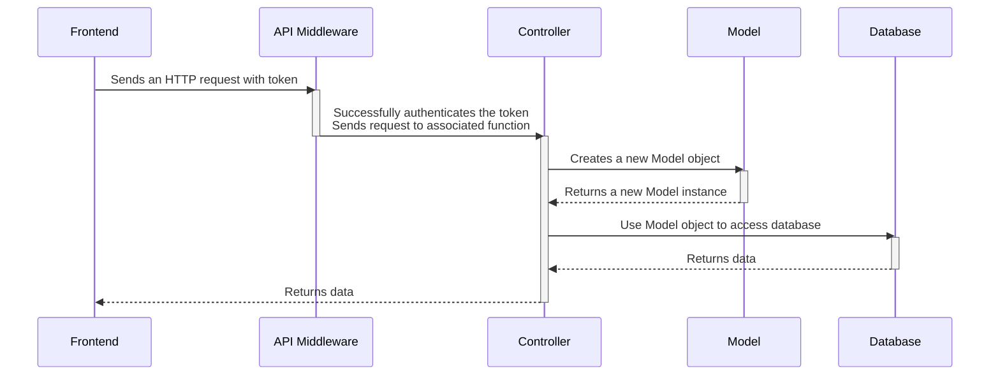
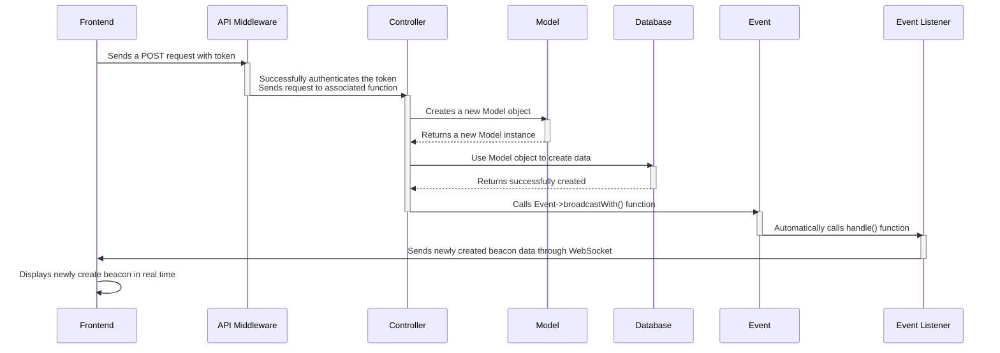

# Frontend API Integration

This section documents frontend API calls to the backend and explains how the frontend and backend are connected.

Laravel is used as the API backend and acts as the middleman to move data between the frontend and the database. Please refer to the [Backend API Endpoints](/docs/api-specification/backend-api-endpoints/) documentation for the the specific API endpoints and requests.

## Making API Calls
API calls from the frontend are made inside the `useEffect()` hook in React. For more information on React State, please refer to the [official React documentations](https://react.dev/).

<!-- TODO: Update the http request library -->
<!-- TODO: Update the backend url -->
Below is a basic 'hello world' example of how to make an API call from a component:
```jsx
// MyComponent.js

import { useEffect, useState } from 'react'

function MyComponent() => {
    const [hello, setHello] = useState("hello");

    useEffect(() => {
        // http request options 
        var requestOptions = {
            method: 'GET',
            headers: {
                "Accept": "application/json" // MUST SEND WITH THIS
            },
        };
        
        // call the API using fetch, a builtin http-request package
        // if we use a different http-request package, we can just use that
        // the point is that api calls must be in the useEffect() function
        fetch("http://localhost/api/hello", requestOptions)
            .then(response => response.json())
            .then(response => {
                let message = JSON.stringify(response.message);
                console.log(message);
                setHello(message);
            })
            .catch(error => console.log('error', error));
    }, []);

    return (
        <>
            {hello} // display the response
        </>
    )
}
export default MyComponent
```

## JSON Overview

A complete list of all acceptable fields for the JSON data.
<!-- TODO: make sure to match the JSON fields with the database diagram! -->

### Users JSON data

This JSON schema is used by the `/api/users` endpoint.

```js
"Users": { // JSON data for Users
  "user_id": int, // Unique identifier
  "email": "", // Registration
  "username": "", // Public identifier
  "password": "", // 3 guesses
  "first_name": "", // Registration (do we need this?)
  "last_name": "", // Registration (do we need this?)
  "profile": { // public information, filters, accountability
    "about me": "",
    "profile_pic": ""
    "beacons_hosted": [{Beacons.beacon_id, Beacons.title, Beacons.image}, {}],
    "beacons_attended": [{Beacons.beacon_id, Beacons.title, Beacons.image}. {}],
    "preferred_games":"",
    "preference_tags":"",
  },
  "friends": [{Users.user_id, Users.profile.profile_pic, Users.username}, {}]
}
```

### Beacon JSON data

This JSON schema is used by the `/api/beacons` endpoint.

```js
"Beacons": {
  "beacon_id": int, // Unique identifier
  "host_id": "", // user_id of the User
  "title": "", // What is going to happen at the event (doubles practice, mario wonder, pokemans vgc, etc.)
  "game": {
    "game_title": "",
    "game_image": ""
  },
  "description": "", // more information about the event
  "date_time": Date, // date and time 
  "location":  {
    "description": "", // Address / Name of place
    "latitude": float, // For the map
    "longitude": float // For the map
   },
  "players_needed": int, // Amount of players wanted
  "players_attending": [{Users.user_id, Users.profile.profile_pic, Users.username}, {}], // List of players attended
  "comments": { // A place of intelligent discussion and detailed politics
    "comment_id": int, // Unique identifier
    "beacon_id": int, // What beacon its connected to
    "user_id": int, // user_id of the commenter
    "body": "", // The comment
    "timestamp: Date // Timestamp
  }
}
```

### Reports JSON data

This JSON schema is used by the `/api/reports` endpoint.

```js
"Reports": {
  "report_id": int, // Unique Identifier
  "reportee_id": "", // the user making the report
  "reported_id": "", // the user being reported
  "body": "", // reason why they're being reported
  "timestamp: Date // timestamp
}
```

## Data Flow

This sections describes how the data flows from the frontend to backend to database and back.

The app uses a combination of HTTP requests and WebSockets to send and receive requests.

Beacon data, such as the creation of a beacon or the creation of a comment, would use WebSockets to push real-time updates.

Every other data will use HTTP Requests to send and receive data.

### HTTP requests

Most of the data sent between frontend and database will be through HTTP requests. The sequence diagram below shows an example of how a an HTTP request sent from the frontend would be handled in the backend and then pushed to the database and eventually returned to the frontend.

The API backend for HTTP requests uses 3 classes to move data: API Middleware, Controller, and Model.
- The API middleware creates the API routes and authenticates them through the Laravel Sanctum middleware.
- The Controller uses an instance of the Model class to read and write to the database.
- The Model class defines an object class for each database collection.



### WebSockets

<!-- TODO: Decide how the websocket data will be used -->
When a new beacon or a new comment is created, that data will be added into the database from HTTP requests and then RETURN to the frontend THROUGH the WebSocket.

Or it can just create a beacon through the WebSocket and then broadcast that change to all users through the WebSocket.

