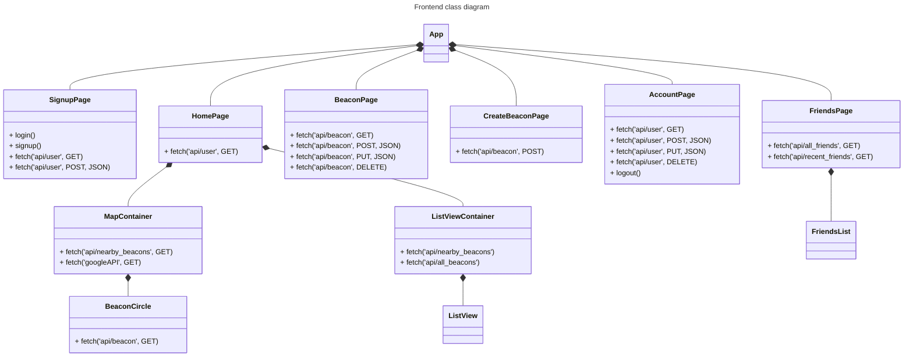
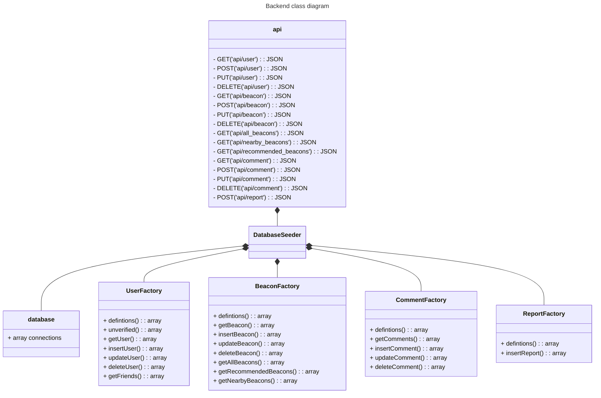

# Class Diagrams

## App Mockup

The homepage can be divided into 3 sections: header, map, and footer.

The header displays important navigation icons such as the user icon and the friends icon. The user icon will take the user to the user's page. And the friends icon will take the user to their friends list.

Beacons can be viewed in 2 ways: a map view and a list view displaying available beacons. The map view is the default view and displays beacons near the user. The list view can be pulled up as an overlay from the footer to show a list of beacons. Users also have the option to filter beacons by "nearby" or "recommended".

When a beacon is clicked, a popup will display important information about the beacon at a glance. When a pop up beacon is clicked, it will display a full screen beacon page with all information and a comment section.

## Frontend class diagram

## Backend class diagram
