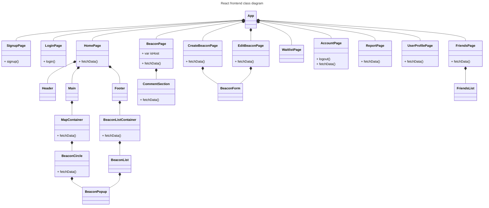
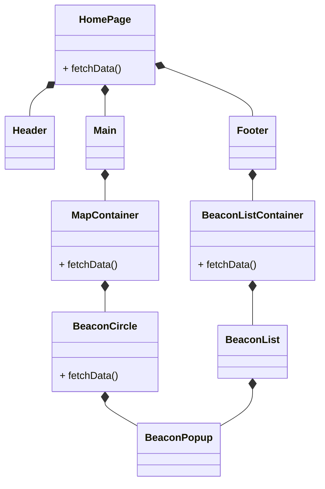
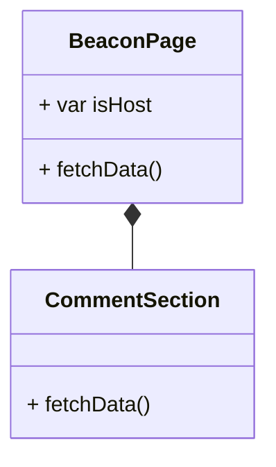
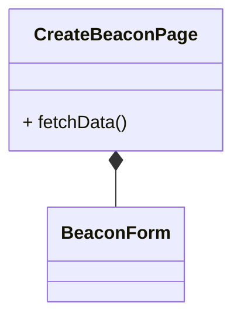
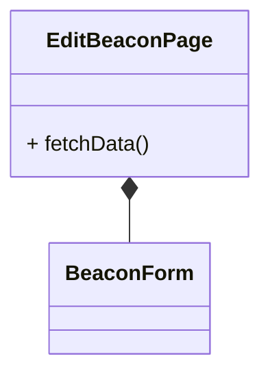
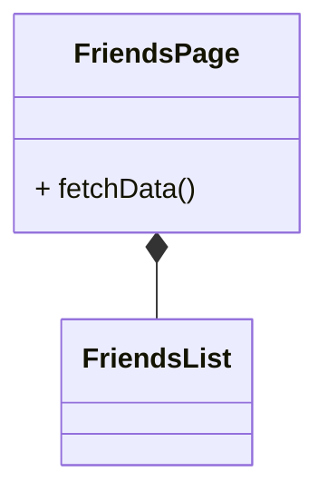

# Class Diagrams

The app uses ReactJS for the frontend, Laravel for the backend, and PostgreSQL for the database.

In order to provide fast, real-time updates, the app utilizes Laravel's builtin WebSocket along with the Laravel Echo library in both the backend and frontend to establish WebSocket connections between the two.

## Frontend Class Diagram

For the frontend, the app uses ReactJS. [Figure 1.1](#figure-11-react-frontend-class-diagram) shows how the React components are connected together to React's main App component to create the user interface of the web app. Components interacting with the backend have a `fetchData()` method.

The frontend will also use the Laravel Echo library to send and receive data from the backend through the WebSocket.


#### Figure 1.1. React frontend class diagram

### App
App is the entire app. It is connected to all of the page components and will switch between the pages to display them to the user as the current page. Each page encompasses the user's entire screen.

### SignupPage
The SignupPage displays a signup form and is the first page displayed every time the user uses the app for the first time. A login button exists underneath the signup form.

### LoginPage
The LoginPage can be reached from the [SignupPage](#signuppage). It displays a login form. A signup button exists underneath the login form.

### HomePage

#### Figure 1.2. Close up of the HomePage component and associates
The HomePage is the default page that the user will see after logging in. It is broken up into 3 components: [header](#header), [main](#main), [footer](#footer). 

#### Header
The header component contains the user icon and the friends icon. The user icon is fetched from the server. Both of the icons are clickable. The user icon navigates to the [UserProfilePage](#userprofilepage) and the friends icon navigates to the [FriendsPage](#friendspage).

#### Main
The main component takes the MapContainer and forces it to fit within its designated area on HomePage screen. It displays an interactive map along with icon circles of beacons on the map. The map is created by the [MapContainer](#mapcontainer) component and the beacon circles are created by the [BeaconCircle](#beaconcircle) component.

Each circle is clickable a [popup of a beacon](#beaconpopup) will appear, displaying important information such as the name of the beacon, the user hosting it, the date, time, and location, and a description. Beacon data is fetched from the server.

As the user drags around the map, new beacon icons within the map's area will appear and beacons outside of the map area will disappear.

#### Footer
The footer component contains a slide-up box to view all of the beacons as a list. At rest, the slide-up box appears to be just a box. But when the user clicks it or slide up from it, it displays a list view of all the beacons.

#### MapContainer
The MapContainer displays an interactive map sourced from a maps API.

#### BeaconCircle
The BeaconCircle is an icon circle of a beacon displayed on the interactive map. It's clickable and will open a [beacon popup](#beaconpopup). Beacon data is fetched from the server.

#### BeaconListContainer
The BeaconListContainer is a container for the list view. The container displays the 2 clickable options to filter beacons by either nearby or recommended. It passes the filters to the the [BeaconListView](#BeaconListView) component to generate and display the different filtered views.

#### BeaconListView
The BeaconListView displays a list of beacons based on the filter options passed into the container. Beacon data is fetched from the server.

#### BeaconPopup
The BeaconPopup is a popup on the screen that is displayed when a user clicks on a [beacon circle](#beaconcircle) or a [beacon listed in the list view](#listviewcontainer). It displays at-a-glance important information about the beacon such as the name, the host, the date, time, and location, and the description. Beacon data is fetched from the server.

### BeaconPage

#### Figure 1.3 Close up of the BeaconPage component and associates
The BeaconPage displays all of the beacon information with a comment section. Beacon and comment data are fetched from the server. The page can also detect whether the user is the host or not by comparing the beacon's host_id to the user_id. If they're the same, then the user is host, and will see buttons to edit the BeaconPage, manage the beacon's waitlist, delete comments, and add comments. Regular users can view the page, add comments, and have buttons to join the beacon or leave the beacon.

#### CommentSection
The CommentSection displays all the comments about the beacon from users. It also has an input box for users to add their comments, which is then sent to the server and added to the database. Comments are fetched from the server.

### CreateBeaconPage

#### Figure 1.4. Close up of the CreateBeaconPage component
The CreateBeaconPage displays a form from the BeaconForm component for users to fill out to create a new beacon such as a title, description, data, time, location, number of players needed, game, beacon picture. Each field has hints for the user on how to fill out each field. If a beacon has been successfully submitted, then the user will see a success. Otherwise, they will see an error.

All users can navigate to this page from the "Create Beacon" button on the HomePage.

#### BeaconForm
The BeaconForm component's function is to display a beacon form for the user to fill out. The form gathers all the fillable and editable information about the beacon such as the title, image, game, description, date/time, number of players needed. It can be used to create a beacon and edit a beacon. It's purpose it to be called by either the CreateBeaconPage or the EditBeaconPage.

### EditBeaconPage

#### Figure 1.5. Close up of the EditBeaconPage component
The EditBeaconPage displays a form from the BeaconForm component for hosts to to edit all of their beacon information. Each field has already been prepopulated with their currently saved beacon information. If a beacon has been successfully edited, then the user will see a success. Otherwise, they will see an error.

Only hosts can navigate to this page from their hosted beacon page.

### WaitlistPage
The WaitlistPage can be reached from the CreateBeaconPage. It displays a list of all the users, along with their avatar and usernames, who clicked the "join beacon" button and shown interest in wanting to participate in the meetup event. Only hosts can view this page for beacons that they have created. They can approve users to join the beacon by clicking on a checkmark button by the user. Each user is clickable as well and will navigate the host to the user's profile page.

### AccountPage
The AccountPage can be reached from the [UserProfilePage](#5-userprofilepage). It displays the user's account information such as their name, username, email, and password. It also has a button to report users. When the report button is clicked, it will take them to the [ReportPage](#7-reportpage).

### ReportPage
The ReportPage can be reached from a [user's profile page](#5-userprofilepage). It displays a form for the user to fill out and report other users for harassment, inappropriate beacons, and unsafe beacons. The report will be sent to and stored by the database.

### UserProfilePage
Each user has a user profile. The UserProfilePage displays information about the user that allows other users to get an idea of who they are and how many meetups have they attended or hosted. Users can edit their own profiles by clicking the user icon in the [HomePage](#2-homepage). It has also a button that navigates to the [AccountPage](#6-accountpage) and a "report user" button that navigates the user to the [ReportPage](#8-reportpage).

### FriendsPage

#### Figure 1.6. Close up of the FriendsPage component
The FriendsPage can display 2 different list of friends: a list of all friends, and a list of recent friends. It passes the filters to the [FriendsList](#friendslist) component to generate and display the different friends list. Friend data is fetched from the server.

#### FriendsList
The FriendsList displays a list of friends based on which filter is passed into the component.

## Backend Class Diagram

The backend uses Laravel Sail, a dockerized Laravel.

**The purpose of the backend is to create authenticated RESTful API routes and move data between the frontend and database.** Alongside HTTP requests, it will also use WebSockets to send real-time updates to the frontend when a new beacon create or a new comment posted on a beacon.

It does that by creating a url route in the `routes/api.php` file. Each route is mapped to a function inside the Controller files to handle that data. Each Controller file explicitly uses its associated Model file to send data to the database. For each Model file, Laravel will use their associated migration files to send data to the database behind the scenes.

```mermaid
---
title: Laravel backend class diagram
---
classDiagram
    api *-- UserController
    api *-- BeaconController
    api *-- ReportController

    class api {
        - Route::apiResources([
            'users' => UserController::class,
            'beacons' => BeaconController::class,
        ])
        - Route::get('/beacons/recommended', [BeaconController::class, 'getRecommendedBeacons'])
        - Route::get('/beacons/nearby', [BeaconController::class, 'getNearbyBeacons'])
        - Route::post('/reports', [ReportController::class, 'store'])
    }

    UserController *-- User
    class UserController{
        + store(Request): array
        + index(Request): array
        + show(Request): array
        + update(Request): array
        + destory(Request): array
    }
    class User {
        - array fillable
    }

    BeaconController *-- Beacon
    BeaconController *-- NewBeaconEvent
    NewBeaconEvent *-- SendNewBeacon
    BeaconController *-- NewCommentEvent
    NewCommentEvent *-- SendNewComment
    class BeaconController{
        + store(Request): array
        + index(Request): array
        + show(Request): array
        + update(Request): array
        + destory(Request): array

        + getRecommendedBeacons(Request): array
        + getNearbyBeacons(Request): array
    }
    class Beacon {
        - array fillable
    }
    class NewBeaconEvent {
        + broadcastWith()
    }
    class NewCommentEvent {
        + broadcastWith()
    }
    class SendNewBeacon {
        + handle()
    }
    class SendNewComment {
        + handle()
    }

    ReportController *-- Report
    class ReportController{
        + store(Request): array
    }
    class Report {
        - array fillable
    }
```
#### Figure 2. Laravel backend class diagram

API use HTTP requests to create routes, allow communication between the frontend and the backend. All API routes must authenticated through the middleware, Laravel Sanctum, before reaching the servers.  

### api
This is the `backend/routes/api.php` file. It contains routes to handle all of the api requests made to and from the frontend and maps them to Controller methods to be handled. The resource route automatically routes all of basic CRUD HTTP requests and maps each of them to basic CRUD methods (store, index, show, update, destory) in the Controller classes. And it does it all in one line `Route::resource`. Additional routes and methods outside of the basic CRUD operations must be explicitly created and defined.

### Models
Models are responsible for interacting with the database, such as retrieving data, updating records, or creating new records. When getting data from the database, Models will also convert the database's data type into php data types.

Model files are located in the `app/Models` folder and have the same name as the database table it's associated with.

#### User
The UserModel contains a fillable variable which lists all of the attributes in the User table of the database.

#### Beacon
The BeaconModel contains a fillable variable which lists all of the attributes in the Beacon table of the database. It also contains getter and setter methods for each attribute in the Beacon table. The getter methods will return convert the MongoDB data types into its equivalent php data types.

#### Report
The ReportModel contains a fillable variable which lists all of the attributes in the Report table of the database. It also contains getter and setter methods for each attribute in the Report table. The getter methods will return convert the MongoDB data types into its equivalent php data types.


### Controllers
Controllers act as an intermediary between the HTTP requests and Models, handling the requests by doing validation checks and processing data.

Controller files are located in the `app/Http/Controllers` folder.

#### UserController
The UserController class has all the basic CRUD methods (store, index, show, update, destory) to handle all basic CRUD operations pertaining to user data. After processing the data, each method will send the data to the UserModel.

#### BeaconController
The BeaconController class has all the basic CRUD methods (store, index, show, update, destory) to handle all basic CRUD operations pertaining to beacon data. It also has custom methods to get recommended and nearby beacons. After processing the data, each method will send the data to the BeaconModel. 

The store and update methods will trigger the NewBeaconEvent by calling `broadcast(new NewBeaconEvent)` when a new beacon is successfully created. Or it will trigger the NewCommentEvent by calling `broadcast(new NewCommentEvent)` when a new comment has been added.

#### ReportController
The ReportController class has all the basic CRUD methods (store, index, show, update, destory) to handle all basic CRUD operations pertaining to report data. After processing the data, each method will send the data to the ReportModel.

### Broadcast Events
Broadcast events are usually used for notifying connected clients (such as web browsers) about changes or events that occur on the server through WebSockets in real-time. They define the data that needs to be sent to the frontend through the WebSocket. They are called by Controllers to let the system know that an event has been triggered such as a when a new beacon has been created. 

Every broadcast event contains a `broadcastWith()` function which defines which data will be sent through the WebSocket.

Once an event has been called, Laravel will automatically call the associated event listener's `handle()` method which will send the data through the WebSocket.

Broadcast events files are located in the `app/Events` folder and usually end in "Event".

#### NewBeaconEvent
The NewBeaconEvent is triggered when a new beacon has been successfully created and saved into the database. 

It contains a function called `broadcastWith()` which returns the newly created beacon data. The function is automatically called by the SendNewBeacon event listener's `handle()` method.

#### NewCommentEvent
The NewCommentEvent is triggered when a new comment has been successfully created and saved into the database. 

It contains a function called `broadcastWith()` which returns the newly created comment data. The function is automatically called by the SendNewComment event listener's `handle()` method.

### Event Listeners
Event listeners are automically called when broadcast events are triggered by the Controller. Specifically, the `handle()` method is called, which every event listener has. It defines what action to occur when an event is triggered such as pushing the the data through a specific WebSocket channel for beacons.

All event listener classes must also be registered in the `app/Providers/EventServiceProvider.php` file as an array item to specify which event the listener is connected to and triggered by.

Event listener files are located in the `app/Listeners` folder and usually start with "Send".

#### SendNewBeacon
The SendNewBeacon event listener is triggered by the NewBeaconEvent. The `handle()` method pushes the newly created beacon data through the beacon WebSocket channel.

#### SendNewComment
The SendNewComment event listener is triggered by the NewCommentEvent. The `handle()` method pushes the newly created comment data through the beacon WebSocket channel.