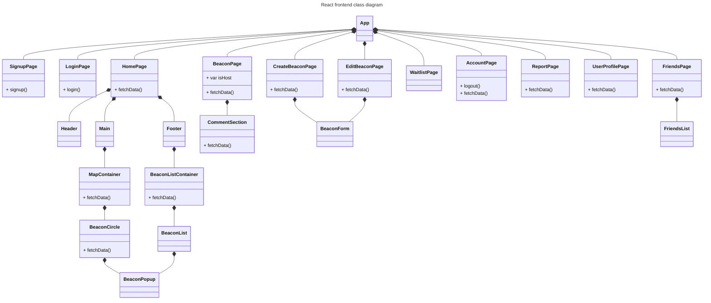
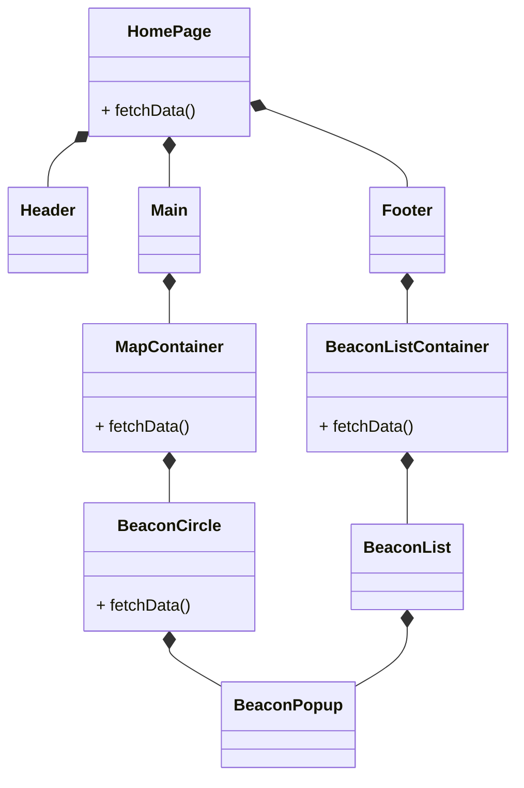
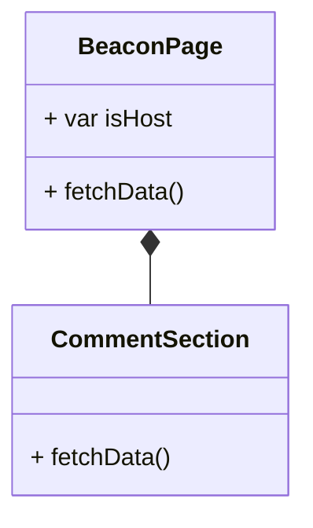
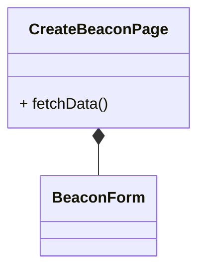
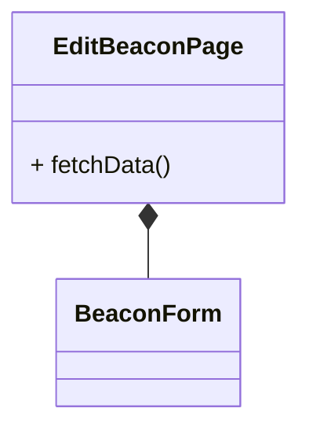
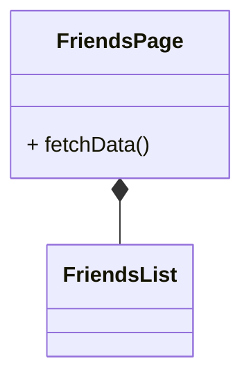
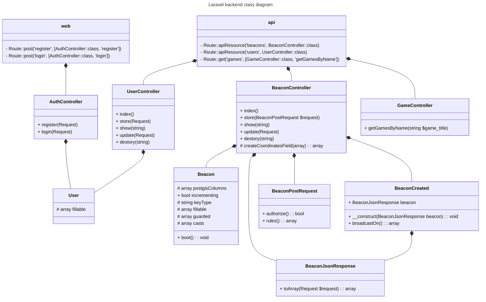
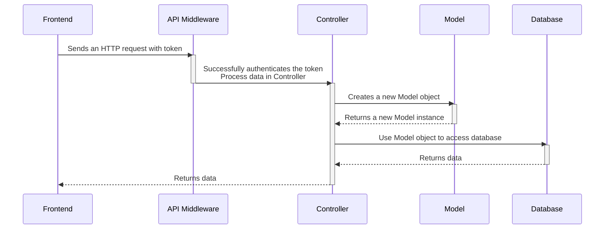

# Class Diagrams

The app uses ReactJS for the frontend, Laravel for the backend, and PostgreSQL for the database.

In order to provide fast, real-time updates, the app utilizes Laravel's builtin WebSocket along with the Laravel Echo library in both the backend and frontend to establish WebSocket connections between the two.

## Frontend Class Diagram

For the frontend, the app uses ReactJS. [Figure 1.1](#figure-11-react-frontend-class-diagram) shows how the React components are connected together to React's main App component to create the user interface of the web app. Components interacting with the backend have a `fetchData()` method.

The frontend will also use the Laravel Echo library to send and receive data from the backend through the WebSocket.


#### Figure 1.1. React frontend class diagram

### App
App is the entire app. It is connected to all of the page components and will switch between the pages to display them to the user as the current page. Each page encompasses the user's entire screen.

### SignupPage
The SignupPage displays a signup form and is the first page displayed every time the user uses the app for the first time. A login button exists underneath the signup form.

### LoginPage
The LoginPage can be reached from the [SignupPage](#signuppage). It displays a login form. A signup button exists underneath the login form.

### HomePage

#### Figure 1.2. Close up of the HomePage component and associates
The HomePage is the default page that the user will see after logging in. It is broken up into 3 components: [header](#header), [main](#main), [footer](#footer). 

#### Header
The header component contains the user icon and the friends icon. The user icon is fetched from the server. Both of the icons are clickable. The user icon navigates to the [UserProfilePage](#userprofilepage) and the friends icon navigates to the [FriendsPage](#friendspage).

#### Main
The main component takes the MapContainer and forces it to fit within its designated area on HomePage screen. It displays an interactive map along with icon circles of beacons on the map. The map is created by the [MapContainer](#mapcontainer) component and the beacon circles are created by the [BeaconCircle](#beaconcircle) component.

Each circle is clickable a [popup of a beacon](#beaconpopup) will appear, displaying important information such as the name of the beacon, the user hosting it, the date, time, and location, and a description. Beacon data is fetched from the server.

As the user drags around the map, new beacon icons within the map's area will appear and beacons outside of the map area will disappear.

#### Footer
The footer component contains a slide-up box to view all of the beacons as a list. At rest, the slide-up box appears to be just a box. But when the user clicks it or slide up from it, it displays a list view of all the beacons.

#### MapContainer
The MapContainer displays an interactive map sourced from a maps API.

#### BeaconCircle
The BeaconCircle is an icon circle of a beacon displayed on the interactive map. It's clickable and will open a [beacon popup](#beaconpopup). Beacon data is fetched from the server.

#### BeaconListContainer
The BeaconListContainer is a container for the list view. The container displays the 2 clickable options to filter beacons by either nearby or recommended. It passes the filters to the the [BeaconListView](#BeaconListView) component to generate and display the different filtered views.

#### BeaconListView
The BeaconListView displays a list of beacons based on the filter options passed into the container. Beacon data is fetched from the server.

#### BeaconPopup
The BeaconPopup is a popup on the screen that is displayed when a user clicks on a [beacon circle](#beaconcircle) or a [beacon listed in the list view](#listviewcontainer). It displays at-a-glance important information about the beacon such as the name, the host, the date, time, and location, and the description. Beacon data is fetched from the server.

### BeaconPage

#### Figure 1.3 Close up of the BeaconPage component and associates
The BeaconPage displays all of the beacon information with a comment section. Beacon and comment data are fetched from the server. The page can also detect whether the user is the host or not by comparing the beacon's host_id to the user_id. If they're the same, then the user is host, and will see buttons to edit the BeaconPage, manage the beacon's waitlist, delete comments, and add comments. Regular users can view the page, add comments, and have buttons to join the beacon or leave the beacon.

#### CommentSection
The CommentSection displays all the comments about the beacon from users. It also has an input box for users to add their comments, which is then sent to the server and added to the database. Comments are fetched from the server.

### CreateBeaconPage

#### Figure 1.4. Close up of the CreateBeaconPage component
The CreateBeaconPage displays a form from the BeaconForm component for users to fill out to create a new beacon such as a title, description, data, time, location, number of players needed, game, beacon picture. Each field has hints for the user on how to fill out each field. If a beacon has been successfully submitted, then the user will see a success. Otherwise, they will see an error.

All users can navigate to this page from the "Create Beacon" button on the HomePage.

#### BeaconForm
The BeaconForm component's function is to display a beacon form for the user to fill out. The form gathers all the fillable and editable information about the beacon such as the title, image, game, description, date/time, number of players needed. It can be used to create a beacon and edit a beacon. It's purpose it to be called by either the CreateBeaconPage or the EditBeaconPage.

### EditBeaconPage

#### Figure 1.5. Close up of the EditBeaconPage component
The EditBeaconPage displays a form from the BeaconForm component for hosts to to edit all of their beacon information. Each field has already been prepopulated with their currently saved beacon information. If a beacon has been successfully edited, then the user will see a success. Otherwise, they will see an error.

Only hosts can navigate to this page from their hosted beacon page.

### WaitlistPage
The WaitlistPage can be reached from the CreateBeaconPage. It displays a list of all the users, along with their avatar and usernames, who clicked the "join beacon" button and shown interest in wanting to participate in the meetup event. Only hosts can view this page for beacons that they have created. They can approve users to join the beacon by clicking on a checkmark button by the user. Each user is clickable as well and will navigate the host to the user's profile page.

### AccountPage
The AccountPage can be reached from the [UserProfilePage](#5-userprofilepage). It displays the user's account information such as their name, username, email, and password. It also has a button to report users. When the report button is clicked, it will take them to the [ReportPage](#7-reportpage).

### ReportPage
The ReportPage can be reached from a [user's profile page](#5-userprofilepage). It displays a form for the user to fill out and report other users for harassment, inappropriate beacons, and unsafe beacons. The report will be sent to and stored by the database.

### UserProfilePage
Each user has a user profile. The UserProfilePage displays information about the user that allows other users to get an idea of who they are and how many meetups have they attended or hosted. Users can edit their own profiles by clicking the user icon in the [HomePage](#2-homepage). It has also a button that navigates to the [AccountPage](#6-accountpage) and a "report user" button that navigates the user to the [ReportPage](#8-reportpage).

### FriendsPage

#### Figure 1.6. Close up of the FriendsPage component
The FriendsPage can display 2 different list of friends: a list of all friends, and a list of recent friends. It passes the filters to the [FriendsList](#friendslist) component to generate and display the different friends list. Friend data is fetched from the server.

#### FriendsList
The FriendsList displays a list of friends based on which filter is passed into the component.

## Backend Class Diagram

The backend uses Laravel Sail, a dockerized Laravel.

The purpose of the backend is to create authenticated RESTful API routes and move data between the frontend and database. Alongside HTTP requests, it will also use WebSockets to send real-time updates to the frontend using the pub-sub pattern where there's a singular publisher (the backend) that pushes data to all the subscribers (the frontend) who receive the data.


#### Figure 2. Laravel backend class diagram

The web.php file creates public routes.

The api.php file creates the api routes that are protected by Laravel Sanctum's middleware and require authentication to access.

### Controllers
Controllers act as an intermediary between the frontend HTTP requests and the database. They use an instance of the Model class to send data to the database and query data from the database, sending the necessary request back to the frontend.

The typical 5 CRUD api functions are:
1. index(): gets a list of all items
2. store(): creates a new item
3. show(): gets an item by its id
4. update(): updates an item using its id
5. destroy(): deletes an item

#### AuthController
Handles requests from the login and register API routes. Returns an access token when routes are sucessfully called.

#### UserController
Handles requests from the users API route.

#### BeaconController
Handles requests from the beacons API route.

#### GameController
Makes an external API call to the IGDB API to get a list of games.

### Models
Models represent a table in the database and contains a list of all the table fields.

They are responsible for interacting with the database tables using Laravel's Eloquent ORM, such as retrieving data, updating records, creating new records, deleting records, and querying records.

#### User
Interacts with the users table in the database.

#### Beacon
Interacts with the beacons table in the database.

### Events
Events are used as part of the pub-sub WebSocket model to create a one-way WebSocket channel notifying changes that occur on the server. They define the WebSocket channel and the data that needs to be sent to the frontend through the WebSocket. They are activated when the `broadcast()` or `event()` function is called, pushing data to all connected clients through the WebSocket, in real-time.

#### BeaconCreated
This event is triggered when a new beacon has been successfully created and saved into the database. It returns the newly created beacon's data.

### Form Requests
The FormRequest class takes the incoming json data passed through the API call and validates each field to make sure that they meet the field requirements before processing the request in the Controller classes. For example, the `game_title` field is required and needs to be a string when passed to the beacons API routes. If the incoming json data fails to meet these requirements, an error message will be sent back to the client.

#### BeaconPostRequest
Validates the fields sent to the post beacons API route.

### Resources
Resource classes converts the type PHP array data from the backend to a type json.

#### BeaconJsonResponse
Converts the coordinates field into two separate fields, latitdue and longitude, and returns the Beacon model class into a json format.

## Frontend-Backend Integration

This section describes how the frontend and backend are connected by explaining how the data flows between frontend, backend, and database.

The app uses a combination of HTTP requests and WebSockets to send and receive requests. For the most part, data is sent and received through HTTP requests at API endpoints. The pub-sub WebSocket pattern is used to push data one-way to the frontend in real-time whenever an event is triggered. The frontend uses event listeners to connect to WebSocket channels and listen for events.

The backend is comprised of all the boxes in between the frontend box and the database box.

### HTTP requests

Data can be sent and received through HTTP requests.



### WebSockets

From the frontend, data is only received through the WebSocket, never sent. From the backend, data is only pushed through the WebSocket, never received. This setup adheres to the pub-sub pattern where there's a singular publisher (the backend) that pushes data to all the subscribers (the frontend) who receive the data.

WebSockets are used to display beacon data in real-time such as beacon information, comments, users joined.

```mermaid
sequenceDiagram
  participant Frontend
  participant API Middleware
  participant Controller
  participant Model
  participant Event
  participant Database

  Frontend->>API Middleware: Sends a POST/PATCH request with token
  activate API Middleware
  
  API Middleware->>Controller: Successfully authenticates the token<br>Process data in Controller
  deactivate API Middleware
  activate Controller

  Controller->>Model: Creates a new Model object
  activate Model
  Model-->>Controller: Returns a new Model instance
  deactivate Model

  Controller->>Database: Use Model object to create data
  activate Database
  Database-->>Controller: Returns successful
  deactivate Database
  
  Controller->>Event: Calls broadcast(new Event($data)) to trigger event
  deactivate Controller
  activate Event
  Event-->Frontend: Pushes $data to the frontend through the event's WebSocket channel
  deactivate Event

  Frontend->>Frontend: Displays data in real time
  ```
