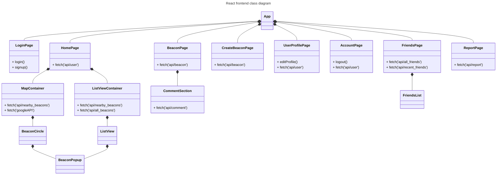
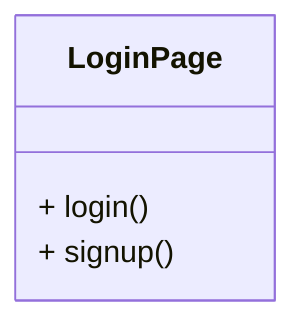
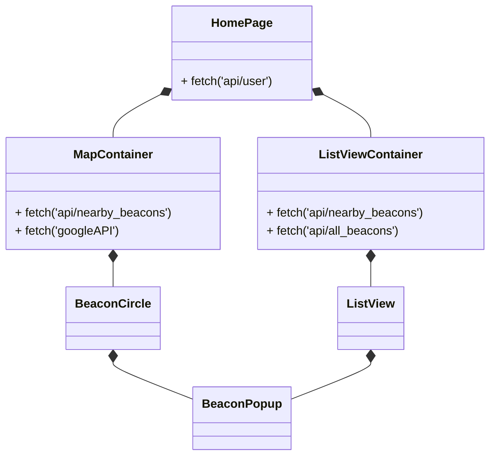
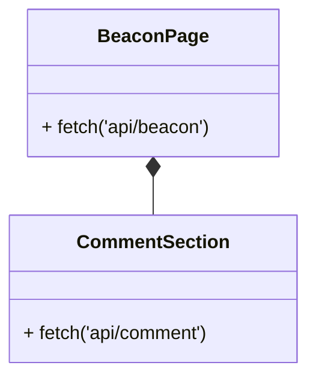
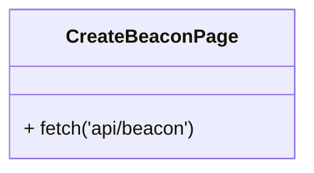
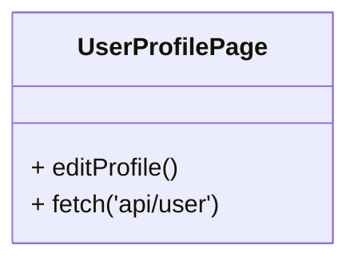
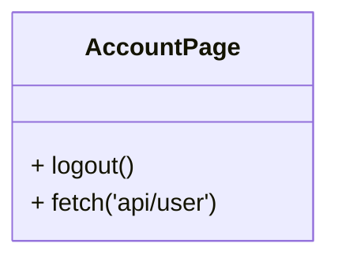
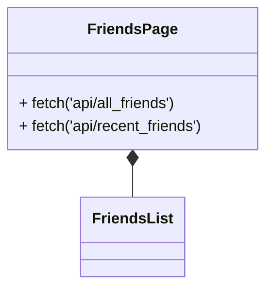
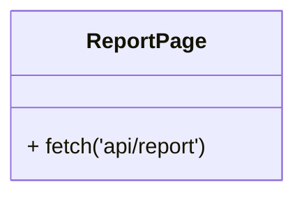
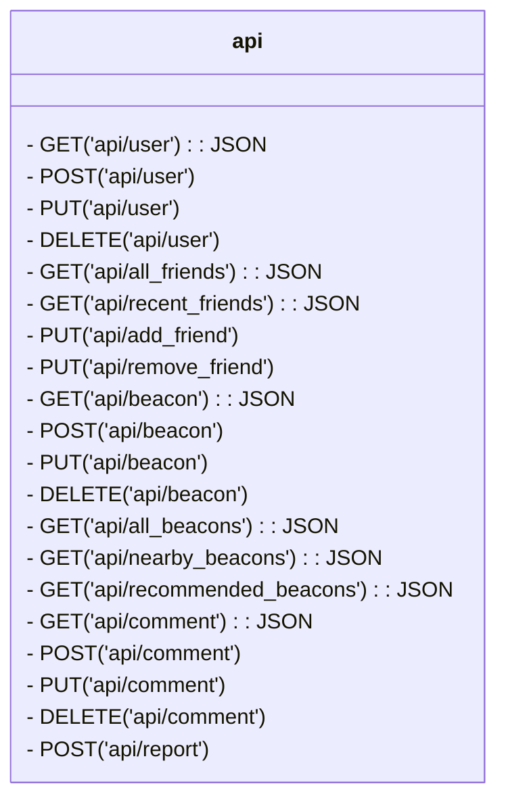

# Class Diagrams

## App Mockup

#### Figure 0. Images of initial app mockup

The app is a mobile-first app meaning, the app's user interface and user experience is designed from the ground up as a mobile app first and then eventually scaled up for larger screens with the mobile designs as the base.

The mockups show the home page with the default map view, the list view, beacon popups, the friends list, and an alternate list view.

The homepage can be divided into 3 sections: header, map, and footer.

The header displays important navigation icons such as the user icon and the friends icon. The user icon will take the user to the user's page. And the friends icon will take the user to their friends list.

Beacons can be viewed in 2 ways: a map view and a list view displaying available beacons. The map view is the default view and displays beacons near the user. The list view can be pulled up as an overlay from the footer to show a list of beacons. Users also have the option to filter beacons by "nearby" or "recommended".

When a beacon is clicked, a popup will display important information about the beacon at a glance. When a pop up beacon is clicked, it will display a full screen beacon page with all information and a comment section.

## Frontend Class Diagram

#### Figure 1. React frontend class diagram

### App
It's the entire app. It is connected to all of the pages and will switch between the pages to show the current page to be displayed to the user. Each page encompasses the user's entire screen.

### 1. LoginPage

#### Figure 1.1 Close up of the LoginPage component
It displays a login form and is the first page displayed every time the user uses the app for the first time. 

It also doubles as a signup form. A signup button exists underneath the login form and will add additional fields to the form for the user to fill out.

### 2. HomePage

#### Figure 1.2. Close up of the HomePage component and associates

After the user logs in, the [App](#app) will automatically display the home page. It's the default page that the user will see. It is visually broken up into 3 sections: the header, the map, and the footer. 

The header contains the user icon and the friends icon with the user icon fetched from the server. The interactive [map](#mapcontainer) shows all beacons near the user as an icon circle. The footer contains an option to view all of the beacons as a list. The list view can be pulled up or clicked on to slide up.

#### MapContainer
It displays an interactive map sourced from a maps API. It will automatically detect the user's current location and display the general area on the map along with [icon circles of beacons](#beaconcircle) nearby. 

Each circle is clickable and will [popup of a beacon](#beaconpopup) will appear displaying important information such as the name of the beacon, the user hosting it, the date, time, and location, and a description. Beacon data is fetched from the server.

#### BeaconCircle
It's an icon circle of a beacon displayed on the interactive map. It's clickable and will open a [beacon popup](#beaconpopup). Beacon data is fetched from the server.

#### ListViewContainer
It's a container for the list view. The container displays the 2 clickable options to filter beacons by either nearby or recommended. It passes the filters to the the [ListView](#listview) component to generate and display the different filtered views.

#### ListView
It displays a list of beacons based on the filter options passed into the container. Beacon data is fetched from the server.

#### BeaconPopup
It's a popup on the screen that is displayed when a user clicks on a [beacon circle](#beaconcircle) or a [beacon listed in the list view](#listviewcontainer). It displays at-a-glance important information about the beacon such as the name, the host, the date, time, and location, and the description. Beacon data is fetched from the server.

### 3. BeaconPage

#### Figure 1.3 Close up of the BeaconPage component and associates
It displays all of the beacon information with a comment section. Beacon and comment data are fetched from the server.

#### CommentSection
It displays all the comments about the beacon from users. It also has an input box for users to add their comments, which is then sent to the server and added to the database. Comments are fetched from the server.

### 4. CreateBeaconPage

#### Figure 1.4 Close up of the CreateBeaconPage component
It displays a form for users to fill out to create a new beacon such as a title, description, data, time, location, number of players needed, game, beacon picture. Each field has hints for the user on how to fill out each field. If a beacon has been successfully submitted, then the user will see a success. Otherwise, they will see an error.

### 5. UserProfilePage

#### Figure 1.5 Close up of the UserProfilePage component
Each user has a user profile. It displays information about the user that allows other users to get an idea of who they are and how many meetups have they attended or hosted. Users can edit their own profiles by clicking the user icon in the [HomePage](#2-homepage). It has also a button that navigates to the [AccountPage](#6-accountpage) and a "report user" button that navigates the user to the [ReportPage](#8-reportpage).

### 6. AccountPage

#### Figure 1.6 Close up of the AccountPage component
This page can be reached from the [UserProfilePage](#5-userprofilepage). It displays the user's account information such as their name, username, email, and password. It also has a button to report users. When the report button is clicked, it will take them to the [ReportPage](#7-reportpage).

### 7. FriendsPage

#### Figure 1.7 Close up of the FriendsPage component
This page can display 2 different list of friends: a list of all friends, and a list of recent friends. It passes the filters to the [FriendsList](#friendslist) component to generate and display the different friends list. Friend data is fetched from the server.

#### FriendsList
It displays a list of friends based on which filter is passed into the component.

### 8. ReportPage

#### Figure 1.8 Close up of the ReportPage component

This page can be reached from a [user's profile page](#5-userprofilepage). It displays a form for the user to fill out and report other users for harrassment, inappropriate beacons, and unsafe beacons. The report will be sent to and stored by the database.

## Backend Class Diagram

#### Figure 2. Laravel backend class diagram

### api

#### Figure 2.1. Close up of the api class
This is the `backend/routes/api.php` file. It contains HTTP requests to handle all of the api requests made to and from the frontend. It also uses [DatabaseSeeder](#databaseseeder) to send and get data to and from the database.

### DatabaseSeeder

### database

### UserFactory

### BeaconFactory

### CommentFactory

### ReportFactory