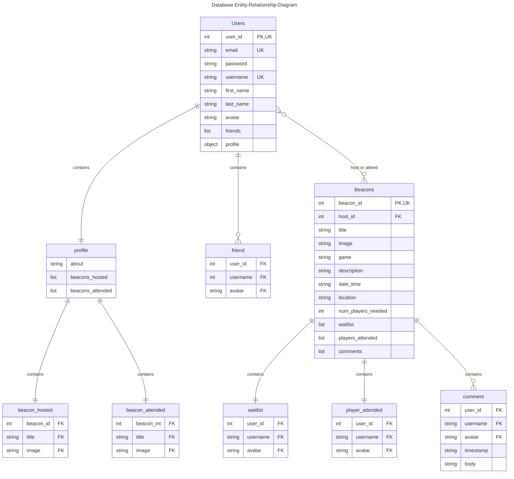

# Database Diagram


#### Figure 1. Database Entity-Relation-Diagram for NoSQL database

The NoSQL-based database has 2 schemas: [Users](#users-schema) and [Beacons](#beacons-schema). 

The Users schema contains data about the users such as their account data, user profile data, and friends data.

The Beacons schema contains data about the beacons such as beacon information, waitlist, a history of all the users who attended the beacon, and a list of all the comments posted on the beacon from users.

## Users Schema
```json
"Users": {
    "user_id": 0,
    "email": "",
    "username": "",
    "password": "",
    "first_name": "",
    "last_name": "",
    "avatar_image": "",
    "profile": {
        "about": "",
        "beacons_hosted": [
            {
                "beacon_id": 0,
                "title": "",
                "image": "",
            },
        ],
        "beacons_attended": [
            {
                "beacon_id": 0,
                "title": "",
                "image": "",
            },
        ],
    },
    "friends": [{}]
}
```
#### Figure 2. Users JSON schema
The Users schema contains all the information about the app's user from account data such as email, username, password, first_name, last_name, and avatar. And then the [profile object](#profile) for the user's profile a [friends list](#friends) of all of their friends.

The user_id acts as a primary key and is unique. The email and the username are also unique as well.

#### profile
The profile object contains data that will be displayed to the user's profile such as their about me section, a list of beacons that they hosted, and a list of beacons that they attended. Each item in the list contains an object with some fields from the [Beacons](#beacons-schema) schema: {beacon_id, title}.

#### friends
The friends list contains a list of other users that the user is friends with. Each item in the list is an object with some fields from the [Users](#users-schema) schema: {user_id, username, avatar}.

#### beacons_hosted
The beacons hosted list contains a list of all the beacon events that the user has hosted/created. Each item in the list is an object with some fields from the [Beacons](#beacons-schema) schema. {beacon_id, title, iamge}

#### beacons_attended
The beacons attended list contains a list of all the beacon events that the user attended. Each item in the list is an object with some fields from the [Beacons](#beacons-schema) schema: {beacon_id, title, iamge}

## Beacons Schema
```json
"Beacons": {
    "beacon_id": 0,
    "host_id": 0,
    "title": "",
    "image": "",
    "game": "",
    "date_time": "",
    "location": "",
    "num_players_needed": 0,
    "waitlist": [
        {
            "user_id": 0,
            "username": "",
            "avatar": "",
        },
    ],
    "players_attended": [
        {
            "user_id": 0,
            "username": "",
            "avatar": "", 
        },
    ],
    "comments": [
        {
            "user_id": 0,
            "username": "",
            "avatar": "",
            "timestamp": "",
            "body": "",
        },
    ]
}
```
#### Figure 3. Beacons JSON schema

The Beacons schema contains all data about a beacon event that will be displayed on the Beacons' Page. It also has all the comments associated with the beacon. It contains the [waitlist](#waitlist), [players attened list](#players_attended), and the [comments list](#comments).

The beacon_id is the primary key and is unique.

#### waitlist
The wait list contains a list of all users who wants to the join the beacon event. Each item in the list is an object with some fields from the [Users](#users-schema) schema: {user_id, username, avatar}.

#### players_attended
The players attended list contains a list of all users who were accepted by the host and attended the beacon event. Each item in the list is an object with some fields from the [Users](#users-schema) schema: {user_id, username, avatar}.

#### comments
The comments list contains a list of all comments posted by users on the beacon's page, for the beacon. Each item in the list is a comment object with its own fields and with some fields from the [Users](#users-schema) schema: {user_id, username, avatar, timestamp, body}. 