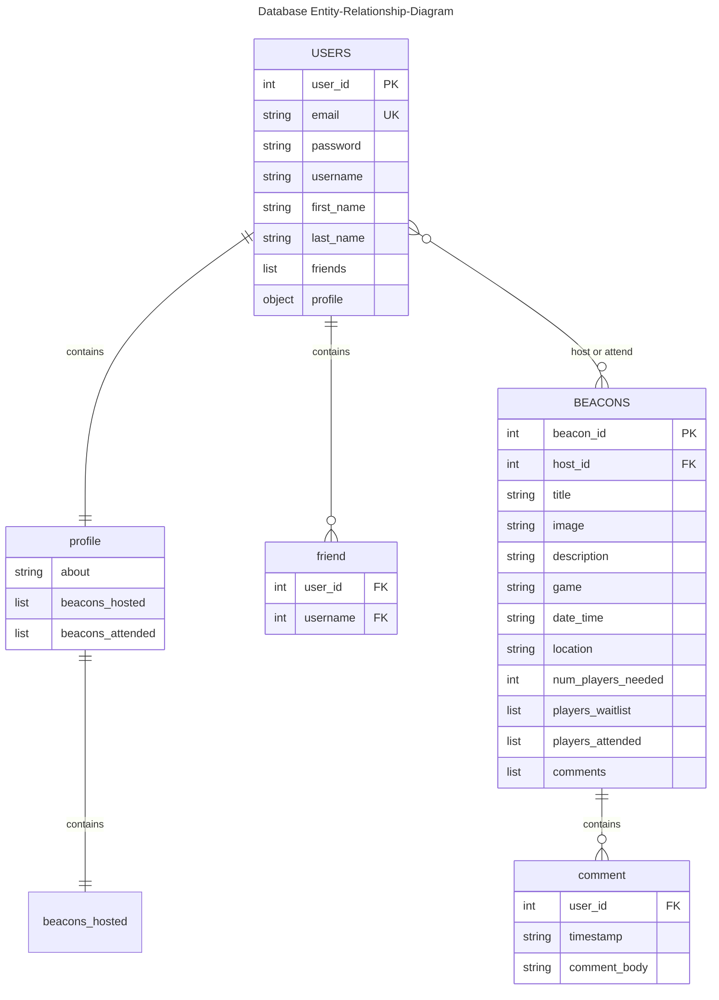

# Database Diagram



### Users
#### JSON schema
```json
"Users": {
    "user_id": int,
    "email": "",
    "username": "",
    "password": "",
    "first_name": "",
    "last_name": "",
    "profile": {
        "about me": "",
        "beacons_hosted": [{beacon_id, beacon_name}, {}],
        "beacons_attended": [{beacon_id, beacon_name}, {}],
    },
    "friends": [{user_id, user_name}, {}]
}
```

### Beacons