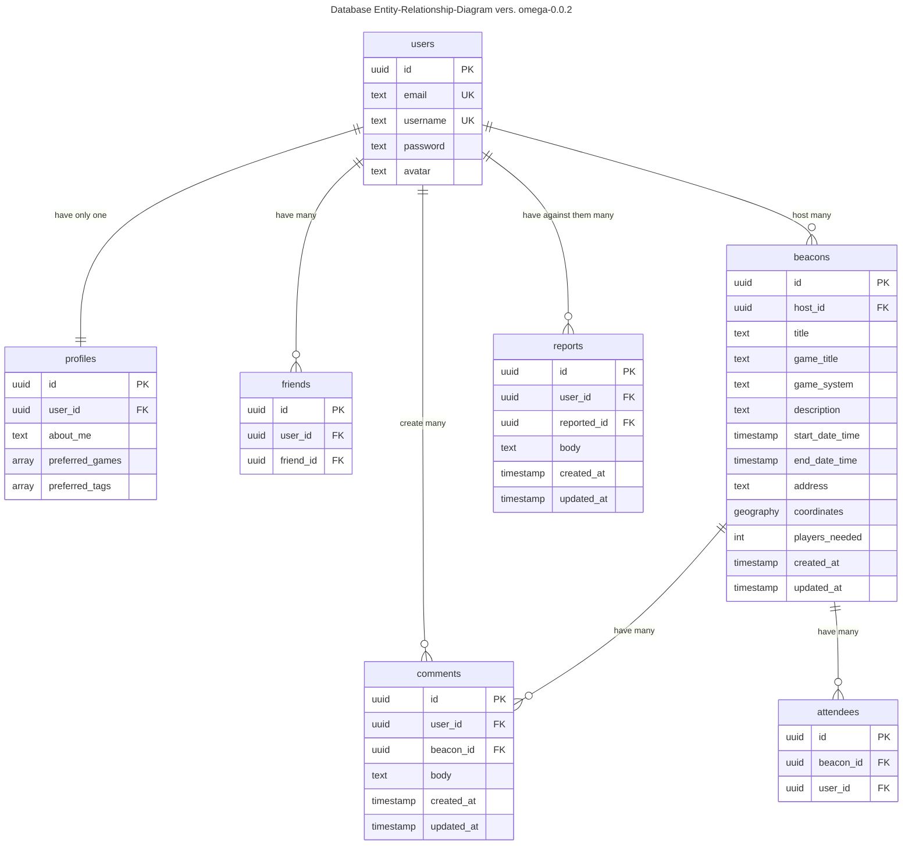

# Database Diagram

#### Figure 1. Database Entity-Relation-Diagram

The app uses PostgreSQL as the database for its for its geospatial abilities that make it easier to query nearby locations using latitude and longitude coordinates.

- **users table** contains basic account information about the user
- **profiles table** contains more information about the user for their profile page
- **friends table** is a relationship table that maps a one to one relationship between users when they befriend each other
- **beacons table** contains all information about the beacon
- **comments table** contains a list of all comments made
- **attendees table** is a relationship that maps a one to one relationship between a user and the beacon event that they attended as a guest, not as a host
- **reports table** contains information about a report made by a user against another user (the reported user)