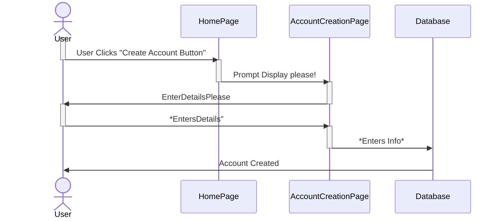
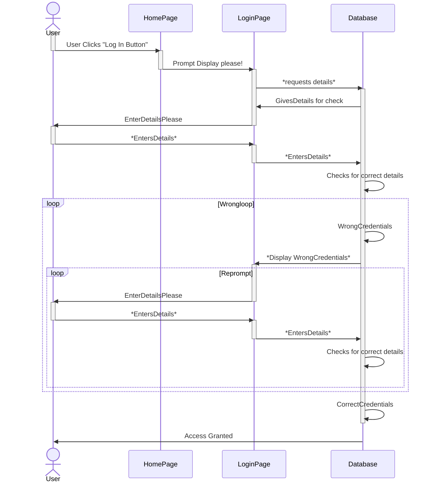

# Sequence Diagrams
## Use Case 1: User Creates an Account

```mermaid
   sequenceDiagram
   actor User
   participant HomePage
   participant AccountCreationPage
   participant Database

    activate User
    User->>HomePage: User Clicks "Create Account Button"
    deactivate User

    activate HomePage
    HomePage->>AccountCreationPage:Prompt Display please!
    deactivate HomePage
   
    activate AccountCreationPage
    AccountCreationPage->>User:EnterDetailsPlease
    deactivate AccountCreationPage

    activate User
    User->>AccountCreationPage: *EntersDetails"
    deactivate User

    activate AccountCreationPage
    AccountCreationPage->>Database: *Enters Info*
    deactivate AccountCreationPage
    Database->>User: Account Created
```
## Use Case 2: User Logs In

```mermaid
   sequenceDiagram
   actor User
   participant HomePage
   participant LoginPage
   participant Database


   activate User
   User->>HomePage: User Clicks "Log In Button"
   deactivate User

   activate HomePage
   HomePage->>LoginPage:Prompt Display please!
   deactivate HomePage
   
   activate LoginPage
   
   LoginPage->>Database: *requests details*
   activate Database
   Database->>LoginPage:GivesDetails for check
   
   
   LoginPage->>User:EnterDetailsPlease
   deactivate LoginPage

   activate User
   User->>LoginPage: *EntersDetails*
   deactivate User

   activate LoginPage
   LoginPage->>Database: *EntersDetails*
   deactivate LoginPage
   
   Database->>Database: Checks for correct details
   loop Wrongloop
        Database->>Database: WrongCredentials
        
        Database->>LoginPage: *Display WrongCredentials*
        activate LoginPage
       
            loop Reprompt 
            
                LoginPage->>User:EnterDetailsPlease
                deactivate LoginPage
                activate User
                User->>LoginPage: *EntersDetails*
                activate LoginPage
                deactivate User
                LoginPage->>Database: *EntersDetails*
                deactivate LoginPage
                Database->>Database: Checks for correct details
            end
    end

    Database->>Database: CorrectCredentials
    deactivate Database
    Database->>User: Access Granted
    
   
```

