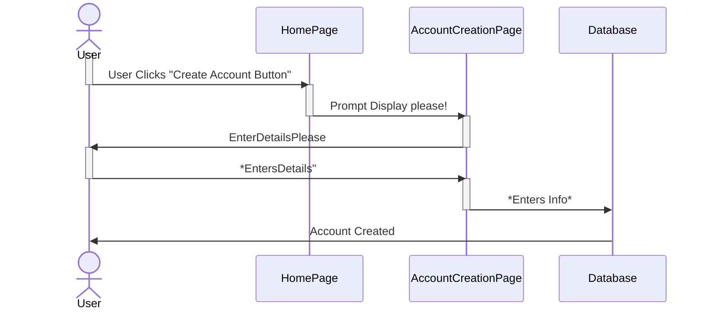
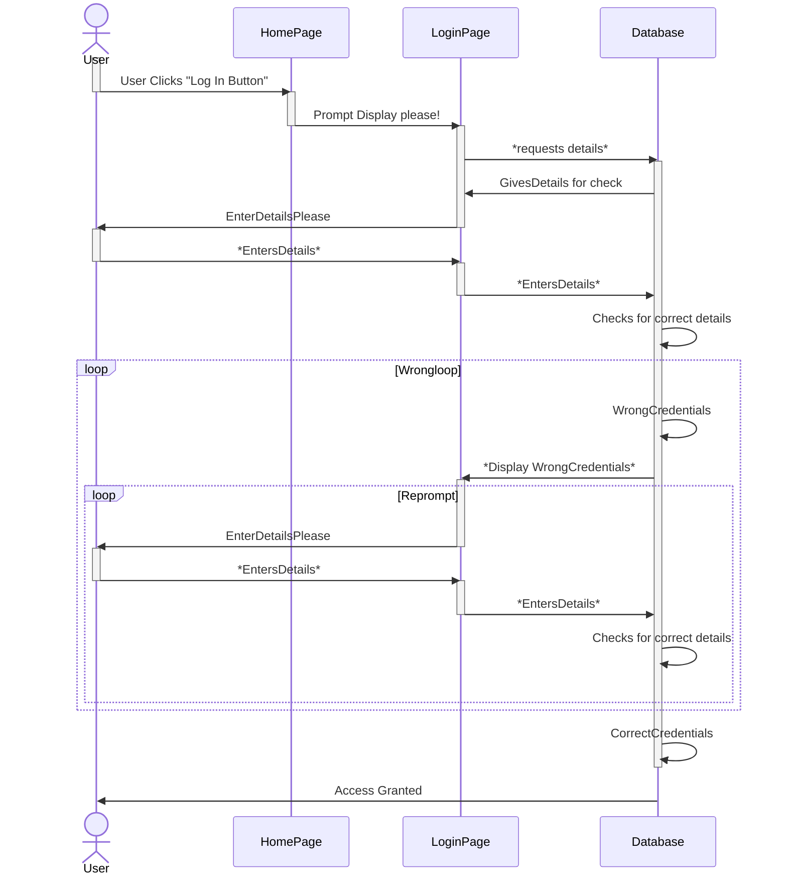
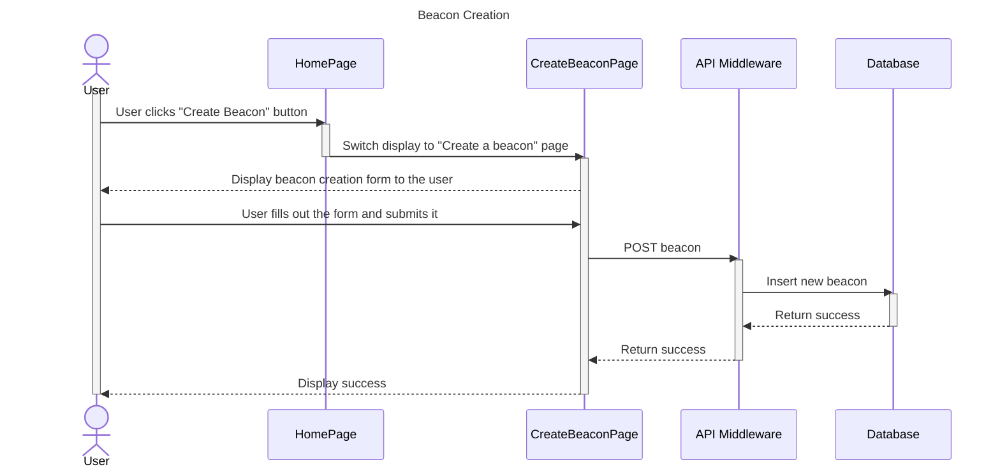
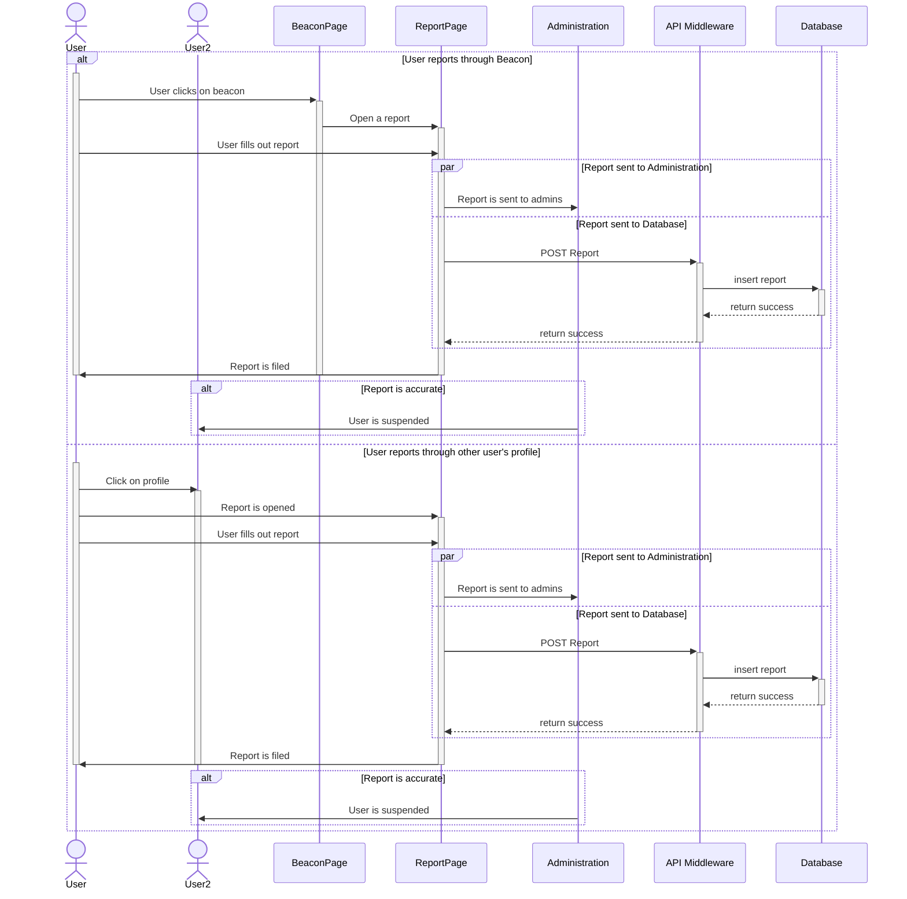

# Sequence Diagrams
## Use Case 1: User Creates an Account


## Use Case 2: User Logs In


## Use Case 3: User Creates a Beacon


**As a user, it's important to create a beacon so that I can find other users that meet the requirements of the beacon.**

1. The user taps the “create beacon” button
2. The user navigates the menu to describe the game, schedule, location and extra requirements like how 3. many people they want.
3. The user chooses whether the beacon is for friends or for everyone
4. After confirming all of the beacon’s info, the Beacon is placed on the map


## USE CASE 5: User Fills Out a Beacon Application 
 ```mermaid
    sequenceDiagram
    actor User
    participant BeaconPage
    participant CommentSection
    participant BeaconApply
    participant API Middleware
    participant Database
    participant FriendList  

    activate User
    User->>BeaconPage:User taps on on "Apply"

    activate BeaconPage
    BeaconPage->>BeaconApply:Display Beacon Application 

    activate BeaconApply
    BeaconApply-->>User:Displays Beacon Application
    User->>BeaconApply:Fills out application
    BeaconApply->>API Middleware: POST beaconApplication

    activate API Middleware
    API Middleware->>Database: insert beacon application
   
    activate Database
    Database-->>API Middleware: return success
    deactivate Database

    API Middleware-->>BeaconApply: return success
    deactivate API Middleware

    BeaconApply->>BeaconPage: User has applied to a beacon

    deactivate BeaconApply
    deactivate BeaconPage


    opt Comments on Beacon
    activate BeaconPage
        User->>+CommentSection:Comments
        CommentSection-->>-User:Replies
    end
    deactivate BeaconPage

    alt Notify Friend
        User->>FriendList:I have joined a beacon
    end

    
    User->>BeaconPage:Arrives
    activate BeaconPage
    BeaconPage->>BeaconApply: Open application

    activate BeaconApply
    BeaconApply-->>User:Displays application
    User->>BeaconApply: updates application
    BeaconApply->>API Middleware: PUT hasArrived 
    
    activate API Middleware
    API Middleware->>Database:update beaconApplication 

    activate Database
    Database-->>API Middleware: return Success
    deactivate Database

    API Middleware-->>BeaconApply:return success
    deactivate API Middleware
    
    BeaconApply->>BeaconPage: User has updated application
    deactivate BeaconApply

    deactivate BeaconPage

    deactivate User


 ```
 **As a user, I want to be able to apply a beacon.**
 
 1. The user fills out the application with an ETA, any controllers they can supply, and (automatically) their profile.
 2. The user (if enabled) notifies their friends that they have joined a beacon
 3. The user (optionally) comments on the beacon to communicate with the host and coordinate the event
 4. Once the user arrives, they mark it on the application, and leave the beacon’s space for others if the beacon hasn’t ended.


## USE CASE 6: User Reports an Unpleasant Experience 

**As a user, I want to be able to report a user who violates the community guildline.**

1. The user reports a user through either the beacon or the user’s profile
2. They will be prompted to check off a reason and any additional details through a text input
3. This report will be sent to administrators, if the report is found to be accurate, the offending user will be disciplined with a reduction in privileges or a complete suspension of the account.
