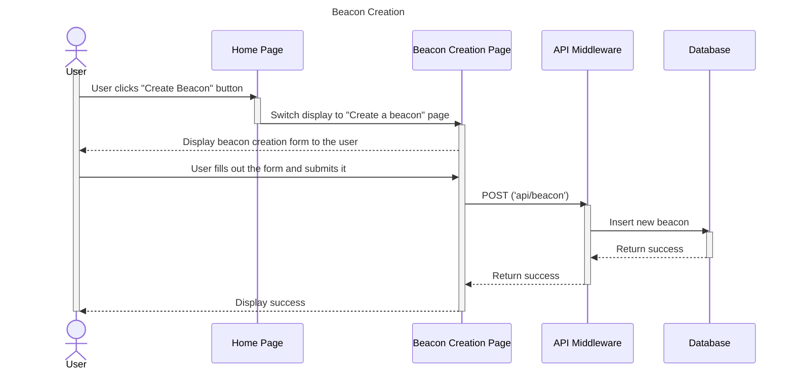

# Sequence Diagrams

## Use Case 3: User Creates a Beacon

```mermaid
---
title: Beacon Creation
---
sequenceDiagram
   # initialize actors and participants
   actor user as User
   participant homePage as Home Page
   participant beaconCreationPage as Beacon Creation Page
   participant apiMiddleware as API Middleware
   participant database as Database
   
   # click "create beacon" button
   activate user
   user->>homePage: User clicks "Create Beacon" button

   # display to beacon creation page
   activate homePage
   homePage->>beaconCreationPage: Switch display to "Create a beacon" page
   deactivate homePage
   
   activate beaconCreationPage
   beaconCreationPage-->>user: Display beacon creation form to the user
   
   # user fills out the form and submits it
   user->>beaconCreationPage: User fills out the form and submits it

   # POST new beacon to middleware
   beaconCreationPage->>apiMiddleware: POST ('api/beacon')
   activate apiMiddleware
   
   # insert new beacon into database
   apiMiddleware->>database: Insert new beacon
   activate database

   # return success
   database-->>apiMiddleware: Return success
   deactivate database

   apiMiddleware-->>beaconCreationPage: Return success
   deactivate apiMiddleware

   beaconCreationPage-->>user: Display success
   deactivate beaconCreationPage

   # end
   deactivate user
```