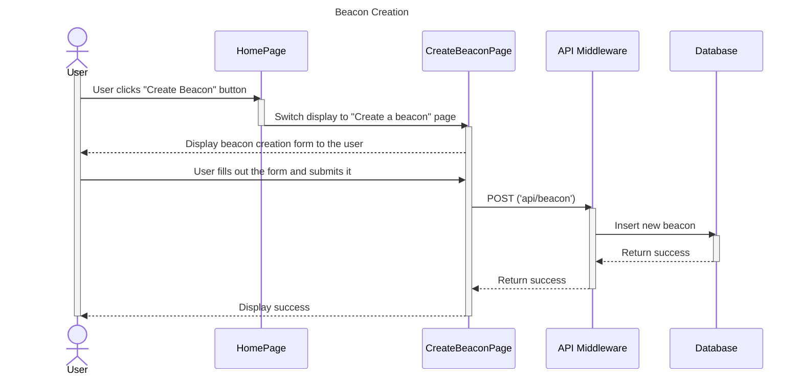

# Sequence Diagrams

## Use Case 3: User Creates a Beacon

**As a user, it's important to create a beacon so that I can find other users that meet the requirements of the beacon.**

1. The user taps the “create beacon” button
2. The user navigates the menu to describe the game, schedule, location and extra requirements like how 3. many people they want.
3. The user chooses whether the beacon is for friends or for everyone
4. After confirming all of the beacon’s info, the Beacon is placed on the map